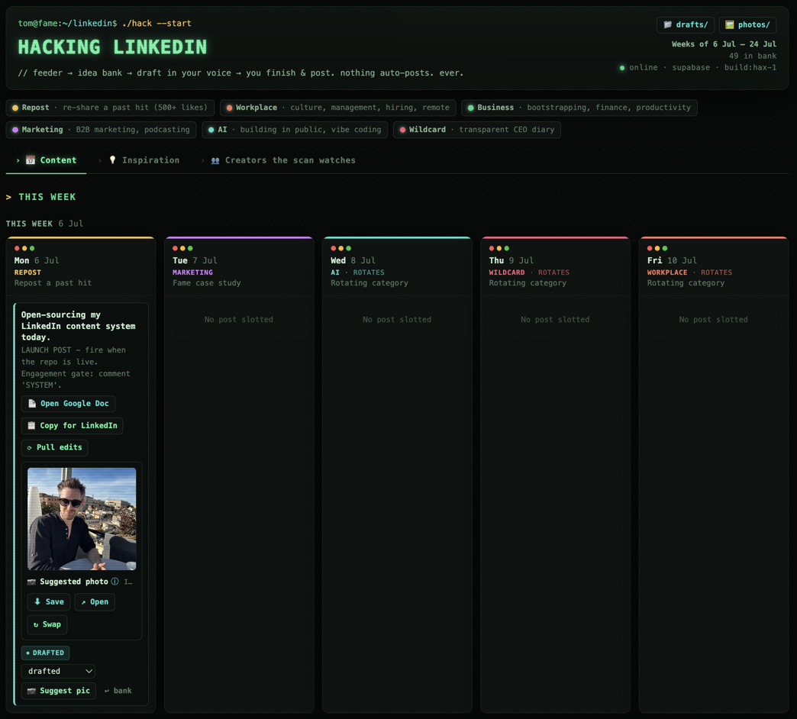

# Hacking LinkedIn

A self-hosted content engine for LinkedIn. It scans creators you trust for inspiration, drafts posts in **your** voice (trained on your own past posts), plans your week, and hands you finished drafts in Google Docs. **Nothing ever auto-posts** - you finish and post everything yourself.

Built by [Tom Hunt](https://tomhunt.io), founder & CEO of [Fame](https://fame.so) (we start and grow B2B podcasts), as a "you could build this yourself now" experiment. Open-sourced so you can too.

> **The pitch:** three years ago this was a $20-50k custom build or an expensive SaaS subscription. Now it's a weekend, some evenings, and an AI that writes in your voice.

### 🎧 Start here - the theory behind the system

This tool automates a specific content strategy. The full thinking - *why* it works, not just how - is laid out in this episode:

## ▶️ **[LinkedIn Growth Hacks You Need in 2025 - Tom Hunt (UnF*ck My Startup)](https://pod.tomhunt.io/e/2nx0v6yn-tom-hunt-unf-ck-my-startup)**

Watch/listen to that first. Everything below is just the machinery that executes it.



---

## What it does

- **📅 Weekly planner** - a 3-week board with a per-day content cadence (repost / case study / rotating pillars), plus an idea bank you triage and draft from.
- **💡 Daily feeder** - each morning it scans a list of creators you choose, surfaces their best recent posts into an **Inspiration** feed, and auto-writes one "draft of the day" from the strongest.
- **✍️ A writer trained on you** - drafts key off *your* voice guide and a corpus of *your own* real posts, so they sound like you, not ChatGPT.
- **👥 Editable creator list** - add or pause the creators the scan watches, from the dashboard.
- **🧩 Chrome extension** - save any LinkedIn post to your bank (with the real permalink) and add any profile to your daily scan, straight from LinkedIn.
- **📄 Google Docs output** - every draft lands in its own Google Doc to edit; a **Copy for LinkedIn** button copies the stored text, and a **Pull edits** button syncs your Doc edits back so Copy matches them.
- **📷 Suggest a photo** - matches a post to a shot from your photo library.
- **🖥️ Terminal UI** - a dark, monospace, hacker-console theme. Don't like it? It's plain CSS at the top of `dashboard/index.html` - restyle away.

The whole thing is model-free at rest (a static dashboard + a tiny local server + JSON files). The AI parts - drafting, scanning, captioning - run in Claude Code.

---

## How it fits together

```
Feeder (Claude Code, daily) ── scans your creators ──▶ Inspiration feed + idea bank
                                                              │
You (dashboard) ── slot / add notes / click "Draft" ─────────┤
                                                              ▼
Writer (Claude Code) ── drafts in your voice ──▶ Google Doc + bank
                                                              │
You ── Copy for LinkedIn ──▶ paste into LinkedIn ──▶ post / schedule (natively)
```

- `dashboard/` - the web dashboard (static HTML/JS).
- `serve.py` - a tiny local server: serves the dashboard and persists changes to the JSON files.
- `data/` - your content: `ideas.json` (the bank), `creators.json` (who the scan watches), `inspiration.json`, `photos.json`.
- `prompts/` - the jobs you run in Claude Code: `feeder.md` (daily scan), `draft.md` (turn "Draft"-clicked ideas into posts), `weekly-draft.md` (batch-draft the week).
- `voice-guide.md`, `voice-examples.md` - how the writer sounds (this is the bit you make your own).
- `chrome-extension/` - the LinkedIn helper (load unpacked; needs the local server running).

---

## Quick start

**Requirements:**
- **Python 3** - runs the dashboard (no other dependencies).
- **[Claude Code](https://claude.com/claude-code)** - runs the AI parts (drafting, scanning, captioning).
- **A browser tool for Claude** - [Claude in Chrome](https://www.anthropic.com/claude-in-chrome) or a Playwright MCP, **signed into LinkedIn** - needed only for the daily scanner (LinkedIn blocks plain fetching).
- *(Optional)* a **Google Drive connector** in Claude Code - only if you want drafts written into Google Docs + the photo-suggest feature. The planner and writer work fine without it.

1. **Clone** this repo.
2. **Run the dashboard:**
   ```bash
   python3 serve.py
   ```
   Open **http://localhost:8000/dashboard/**.
3. **Make it yours:** edit `voice-guide.md` (how your posts sound) and `data/creators.json` (who to scan). Drop a few of your best past posts into `voice-examples.md`.
4. **The AI parts:** open the folder in Claude Code and run the prompts in `prompts/` (`feeder.md` to scan, `draft.md` to draft, `weekly-draft.md` for a weekly batch) - by hand or on a schedule. See **[Run the scanner & drafter](#run-the-scanner--drafter)** below for exactly how. Drafting uses the `linkedin-writer` agent, which reads your voice guide + examples.
5. **Chrome extension (optional):** `chrome://extensions` → enable Developer mode → **Load unpacked** → select `chrome-extension/`. It saves posts/creators by calling your local server, so it only works while `python3 serve.py` is running.

> The Google Docs and Google Drive photo features assume you're driving them through Claude Code with a Google Drive connector. They're optional - the core planner + writer work without them.

---

## Run the scanner & drafter

The dashboard is static; the "AI parts" are just prompts you run in **Claude Code** with the repo folder open. Three jobs, each a file in `prompts/`:

| Job | What it does | How to run |
|---|---|---|
| **Scanner** (`prompts/feeder.md`) | Scans your creators + keywords, drops 5-8 fresh ideas into the bank each day | Needs a browser tool (Claude in Chrome / Playwright) signed into LinkedIn |
| **Drafter** (`prompts/draft.md`) | Turns the ideas you clicked **Draft** on into finished posts in your voice | Runs any time; no browser needed |
| **Weekly** (`prompts/weekly-draft.md`) | Batch-drafts the whole coming week in one go | Runs any time |

**Two ways to run each:**

1. **By hand** - open the repo in Claude Code and say *"run the feeder prompt"* (or paste the file's contents). Do this whenever you like.
2. **On a schedule (hands-off)** - ask Claude Code to set it up as a **scheduled task**, e.g.:
   > *"Create a scheduled task that runs `prompts/feeder.md` every weekday at 8am."*

   Claude Code runs it automatically on that cadence and writes the results into `data/` - reload the dashboard to see them. (A daily feeder + a drafter every ~15 min is a good starting cadence.)

**First run, end to end:** run the **scanner** → open the dashboard and triage the new ideas (slot them to days, add notes) → click **Draft** on the ones you want → run the **drafter** → reload → finish each draft and post it yourself.

---

## Make it your own - post types & cadence

Everything configurable lives in **one clearly-marked `CONFIG` block** at the top of the `<script>` in `dashboard/index.html` (search for `CONFIG - THIS is the bit to make your own`). No build step - edit, save, reload. In there you can change:

- **Post types (pillars)** - the `PILLARS` object. Add, remove, or rename them; give each a colour (any hex like `"#e11d48"`) and a one-line description.
- **Weekly cadence** - `FIXED_DAY` pins a day to one pillar (e.g. Monday = Repost); any day not pinned rotates through `ROTATE_POOL`, a different pillar each week.
- **Which days you plan** - `DAYS` (add `"Sat"`/`"Sun"` if you post weekends).
- **How many weeks show** - `WEEKS_SHOWN`.
- **The status lifecycle** - `STATUSES` (idea → drafted → posted, or whatever fits you).

> **If you rename or add pillars, also update `pillars.md` and the files in `prompts/`** - those are what the AI writer/feeder read, so they need to know your categories too. (The dashboard is the visual source of truth; those files are the AI's copy.)

## Make the writer sound like *you*

This is the part that matters. Out of the box the voice guide is a template. To get drafts that sound like you:

1. Rewrite `voice-guide.md` in your own terms - your hooks, your enemies, your rules.
2. Paste 15-20 of your best real posts into `voice-examples.md` (with a line on why each works). The writer pattern-matches against these.

Garbage in, garbage out - a thin voice guide gives thin drafts. Ten minutes here is the highest-leverage thing you'll do.

---

## Philosophy

- **Nothing auto-posts.** The tool drafts; you decide, edit, and post. That guardrail is deliberate.
- **Substance over vanity.** It optimises for posts you'd actually want to publish, not engagement bait.
- **Yours to break.** It's a starting point, not a product. Fork it, rip bits out, rebuild it.

---

## Built by

[**Tom Hunt**](https://tomhunt.io) - founder & CEO of [**Fame**](https://fame.so), the B2B podcast agency. If this is useful, come say hi on [LinkedIn](https://www.linkedin.com/in/tomhuntio/).

## License

MIT - see [LICENSE](LICENSE). Do what you like with it.
